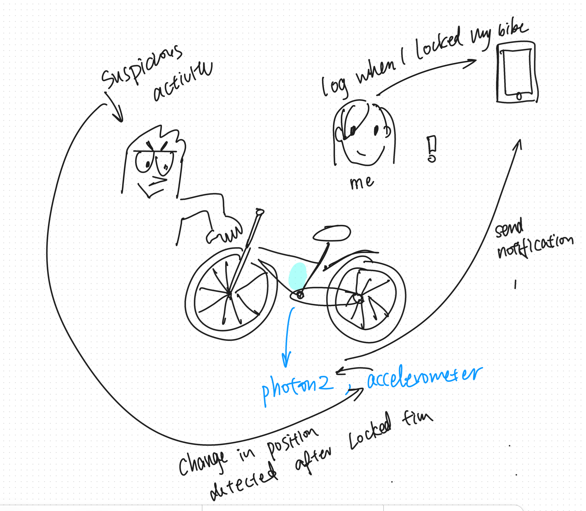
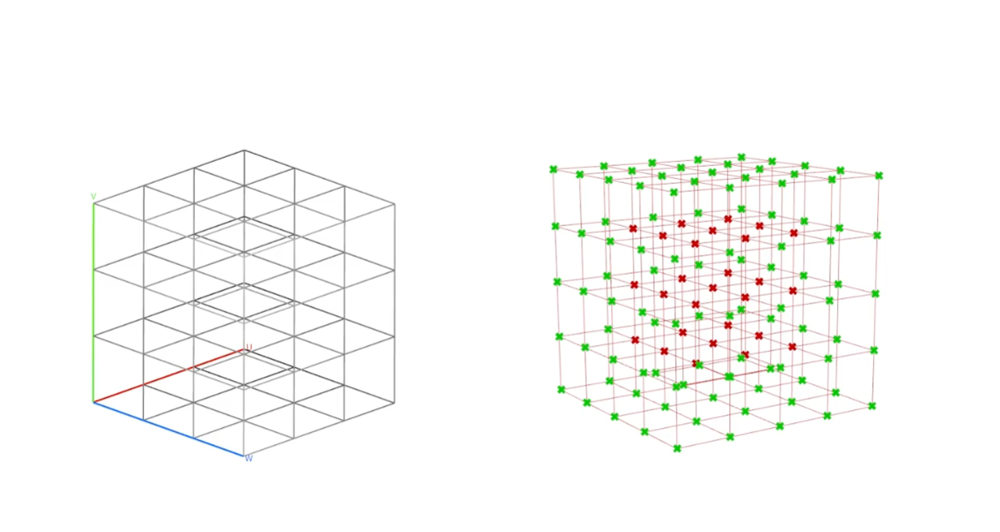

# Hello DES INV 202 Student!
Welcome to your new GitHub repository! 

# Outline
[week 1](README.md#week-1)

[week 2](README.md#week-2)

[week 3](README.md#week-3)

[week 4](README.md#week-4)

[week 5](README.md#week-5)

[week 6](README.md#week-6)

[week 7](README.md#week-7)

[week 8](README.md#week-8)

[week 9](README.md#week-9)

[week 10](README.md#week-10)

[week 11](README.md#week-11)

[week 12](README.md#week-12)

[example](README.md#example-report-1)

# Week 12 #
## Week of 11/21/2024 Thursday
This week, my team's proposal for Project 4 changed drastically. Originally, we were thinking about expanding on the magic wand idea but instilling more meaning into the interaction. Inspired by the scene of fighting boggart in the Harry Potter film, we thought of using stable diffusion to generate images of people's fear and invite them to think of how they could turn their fear into a ridiculous form by casting the ridiculous spell, which perhaps can help them take on a humorous perspective when dealing with fear. We then explored the feasibility of replicating what we imagined using chatGPT and stable diffusion, but the result was not satisfactory. 

In the meantime, we also interviewed a neuropsychology professor who teaches the neuropsychology of happiness. We asked about how professional psychiatrists treat phobia clinically, which led us to this concept of exposure therapy. In this form of therapy, psychologists create a safe environment in which to “expose” individuals to the things they fear and avoid, usually starting with the most acceptable form such as a static image, and then gradually moving up the ladder of fear if they can remain calm. We thought about combining exposure therapy's approach of exposing fear gradually and the interaction of casting a ridiculous spell to reimagine fear on each level, but that just made the technical aspect even more complicated.

In the end, I felt overwhelmed by the limited time, technical ambiguity, and my recently declined energy level. I wanted to create something for mindfulness practices. Recently my mental health has been a bit under the weather, so I tried out a bunch of mindfulness practices for combating anxiety. One of the practices is called the tree grounding technique, which is a mindfulness exercise that heavily relies on imagination, involving oneself picturing his/her body as a tree growthing as they breath and stretch. At the same time, I also recently learned about Aphantasia, which is a characteristic some people have related to how their minds and imagination work. Having it means you don’t have visual imagination, keeping you from picturing things in your mind. When reading through guided instruction scripts, I found many opportunities to transform this exercise from a passive reaction to script to an interactive visualization.

### Reflection

# Week 11 #
## Week of 11/14/2024 Thursday
During Framework on Wednesday, Professor Jodi Forlizz from Carnegie Mellon University gave a lecture on how designers can utilize AI as a material to design products that are feasible, viable, and desirable. 

She proposed an alternative workflow/mindset to human-centered design, which is start by thinking about what data is available or what the technology can offer, and then map that to the use cases that best fit the technology. 

### Reflection
An interesting metaphor came to my mind when thinking about these two opposing mindsets: Completing a jigsaw puzzle.

The technology-centered workflow is similar to starting a jigsaw puzzle with a particular jigsaw piece. You analyze the shape and color of that piece, and then reason about what kind of gap would best fit such a piece.

The human-centered workflow is like starting to analyze an unfinished jigsaw landscape. You identify the shape of the void and then go on a search for the piece that matches the shape of the void. However, there is a possibility that such a piece doesn't exist in the current world.

### Speculation
With LLM and AI being capable of performing repetitive or low-skill tasks much faster and reliably, engineers will be held to a higher standard. The cultural expectation of entry level engineering will be different from the one from the past, highlighting system thinking skills, integration capability, and fluidity to cross disciplinary boundaries.

# Week 10 #
## Week of 11/7/2024 Thursday
This week, I used my weekly report as the knowledge base and redid experiments 1-4.

I explored how to best structure the data in the knowledge base to yield the best result. 

My first iteration used week as the delimiter to separate my entire weekly report into smaller chunks. I did not do further editing beyond that.

In my second iteration, I structured my knowledge base based on Projects. I will start each chunk with the project it is associated with.

When I asked “What projects have you worked on this semester? “, I prefer the result from the second iteration because the result is more holistic, summarizing all three projects rather than being too narrowed down on one specific project. 

The experiment impacted the way to structure data of knowledge base for my final design. I manually delete all my speculation and reference of projects for inspiration so that the model would not be confused about other people’s work with my work. I also manually tagged each chunk of data with the project it is associated with since project information is not present in my weekly report. 

### Reflection
When adjusting parameters and switching different LLM models, I reflected on how these settings should reflect the use scenario of the Voice AI agent. 

### Speculation
Just as the Industrial Revolution made human physical labor less central to many processes (thanks to machinery, automation, and mechanization), the rise of Large Language Models (LLMs) and other AI-driven technologies is shifting the role of human cognition and problem-solving in significant ways. We need to think critically about what type of skills make humans unique and focus on developing those complementary skills.

# Week 9 #
## Week of 10/31/2024 Thursday

### Experiment 1+2+3

The model hallucinated about my undergrad school. I have no idea why it think I graduated from Univeristy of Washington.

But it also knows the correct answer. Very curious about how it process seemingly conflicting information.

Although it knows about my master program, it did not mention Berkeley MDes unless  I specifically asked about it.

The model hallucinated again about my bachelor background, so I decided to take a closer look at the  chunk of the  content.

### Experiment 4

I added two variables, location and time.

### Reflection
In designing AI products, it's essential for designers to be actively involved in shaping user experiences, rather than leaving decisions solely to developers. AI design should shift towards a more collaborative, user-centered approach, similar to product or web design, rather than being confined to deep technical spaces. When developers alone make choices, products may end up neglecting the user’s needs, leading to features that feel impersonal and miss the mark on functionality. A collaborative process, where designers and developers co-create, can better balance innovation with usability. In tools like workbenches for building AI agents, designers can bridge the gap between complex backend knowledge systems and the end-user experience, ensuring that AI solutions are truly accessible, engaging, and relevant for users.

### Speculation
Designing for LLM might become the next big challenge for designers. However, unlike design materials in the past, LLM models are like a black box. How can designers define "how it should be" when the subject matter is unpredictable? In the future, I speculate that there will be more tools to unfold the LLM to make them more transparent.

# Week 8 #
## Week of 10/24/2024 Thursday
### Deployment of Edge impulse library
When I first opened up the deployed library, I was very lost on how to move forward from there because the language used in the main.cpp file looks very different from what I usually see in the weekly assignment. 
I decided to perform an incremental test to understand the functions provided by the library.
1. Use raw feature data from live classification result to test locally deployed model

2. Fake serial print with 0s to see how edge impulse changes the raw data from sensor. -> understood that feature data is almost equal to raw sensor data.

3. Directly replace raw feature data list with MPU sensor data as 2D array list.
4. Directly replace raw feature data list with MPU sensor data as 1D array list
5. Check the frequency used for training, sampling, and interpreting data.
    1. Delay time has to remain the same across different stages!
    2. Aligning sampling and training frequencies helps create a more representative, high-quality dataset, allowing the ML model to capture relevant patterns without being misled by noise or data scarcity.
6. Interpolation experiments: 
    1. Hypothesis: Maybe the result is not accurate because the time frame of sampling does not match the time frame of actually performing the spell motion. Having only 1 feature list to infer with made this unmatching time frame problem more prominent. 
    2. Storing 4 sets of feature lists and randomly sample them all together to minimize effects of unmatching time frame
    3. Randomly sampling from 4 sets of feature list
7. See accuracy of unoptimized vs quantized methods.

#### Experiment 2 Impacts:

Alignment of Sampling and Training Frequencies (delay time)
From experimenting with Model 1, I realized that the training frequency I used was too low, risking missing important details in the data, leading to a loss of critical information that can impact model performance, especially in applications where real-time or high-frequency events occur. On the other hand, during deployment, for accurate learning, the training frequency needs to be consistent with the data's sampling frequency. If the model isn't trained on data that matches the rate at which it’s collected, it may not learn patterns that happen over shorter or longer intervals. With aligned sampling and training frequencies, I achieved the 100% accuracy rate in Model 2.

### Establishing connection with cloud + p5.js
Initially, I used particle events  to publish a recognized spell as a string with the spell’s name, but it was causing trouble for p5.js side to fetch the data because it’s not constantly available. After talking to Jeff, I realized that using Particle Variables is a great choice for connecting with p5.js when I need consistent access to specific data without requiring real-time push updates. 

By setting up p5.js to request Particle Variable values through HTTP at defined intervals, this approach proves efficient for several reasons:

1. Reduced Traffic: Instead of constantly broadcasting events from the Particle device, p5.js can retrieve data only when necessary. This reduces network traffic and helps avoid hitting event rate limits.
Ease of Access: Particle Variables allow the p5.js sketch to fetch the current value on demand, giving me full control over how often and when data is retrieved within p5.js itself.
2. Reliability: Since Particle Variables stay available on the cloud, p5.js can always access the most recent value. This provides stability, especially when there are network delays or if the data changes infrequently.

### Experiment 3 Impacts:
Choosing Particle Events and Particle Variables for Different Outputs.
For p5.js, it’s better to use Particle Variable because it’s fetching data constantly.
For the other photon2, it’s better to use Particle Events, which is ideal when needing to send data occasionally, trigger updates, or receive data in real time.

### Speculation ###
Given my project’s use of ML models to distinguish motion patterns, AI could take on a critical role as the “intelligence layer” in Digital Ecosystems. AI’s role could expand to act as a central processor that interprets incoming data from multiple devices, managing responses in real time and adapting to patterns learned from user behavior. In applications similar to the Magic Spell project, AI could recognize complex gesture patterns, adjust digital outputs in real-time, and personalize responses based on previous interactions. This would allow Digital Ecosystems to be context-aware, not only enabling interactive experiences but also supporting adaptive learning from data gathered across interconnected devices. 

### Reflection ###
I learned that when an integration problem occurs, I should never be too sure that the problem is on the other side. Instead, I should establish a good understanding of all the moving parts before concluding.

# Week 7 #
## Week of 10/14/2024 Monday

### Connecting Particle to Edge Impulse ###

Before class on Monday, I was mainly working on connecting photon2 to edge Impulse. 

I ran into a lot of trouble installing the dependencies on my PC and Mac. Below are some error messages from the terminal. I found using ChatGPT to interperate these error messages very helpful.

  
  

Eventually, with the help from our star TA Fareha, I managed to connect my photon2 with edge impulse on my Mac.

I started training my model to recognize the 2 spells for the first experiment: Turning on and off and LED with Lumos and Nox.

These are the results of training data.

### Sketching the wand and interaction set-up ###

I wanted to 3D print a really basic wand to start holding the component together, which can lead to more accurate ML learning data because the MPU sensor will be more secured.

I started sketching and modeling the electronic component in Fusion 360. I downloaded the 3D model of the MPU sensor from Adafruit. Link is here: [adafruit CAD](https://github.com/adafruit/Adafruit_CAD_Parts)

The form right now looks more like a gun than a wand, but form isn't the top priority now..hehe

### Speculation ###
In exploring digital ecosystems through Particle Photon and p5.js integration, I saw firsthand how engineering is evolving to include both tangible devices and digital interfaces that enable seamless communication. In this context, cultural expectations around engineering may shift toward viewing engineers as creators of systems that not only function well individually but also thrive in interconnected, responsive networks. For example, the Magic Spell system’s integration of Particle Photon, sensors, and cloud services illustrates how engineering is moving from standalone functionality to creating ecosystems of devices that "listen," "respond," and adapt in sync. 

### Reflection ###
AI has indeed transformed education by bridging gaps in understanding complex subjects, like working with the Terminal. Previously, I saw interacting with the Terminal as a daunting challenge—it felt like deciphering a foreign language, with cryptic messages and commands that seemed impossible to interpret without extensive experience. The Terminal operates in a syntax that’s precise yet unforgiving, making it difficult for newcomers to troubleshoot errors or understand messages intuitively.

With AI, however, there's a shift in how we can approach learning the Terminal. AI-driven tools can act as interpreters, breaking down error messages, suggesting solutions, and even explaining the underlying processes in clear, accessible language. This makes the Terminal more accessible and less intimidating, helping users—especially beginners like myself—gain confidence as they navigate commands and solve problems.

# Week 6 #
## Week of 10/07/2024 Monday

### MPU6050 Testing ###
Getting raw data values from the IMU:

I was curious about how to interoperate the value it spits out. Here is what I found out about the sensors:
  ### Accelerometer :

  Measures linear acceleration along the x, y, and z axes.
  It provides values that correspond to the rate of change of velocity, including detecting gravity (e.g., in the MPU6050, it's often used to determine tilt or orientation).

  Units: meters per second squared (m/s²) or "g" force.

  Example use: detecting whether the device is moving or stationary and in which direction, sensing orientation changes like when a phone is rotated.

### Gyroscope:

  Measures angular velocity (the rate of rotation) around the x, y, and z axes.

  It provides values related to how fast an object is rotating in space.

  Units: degrees per second (°/s) or radians per second (rad/s).
  Example use: sensing rotational movement, like when a person turns their wrist or when stabilizing a camera.

  ### Mapping Value:
  Now, moving onto mapping the raw value ( 16-bit signed values) to meaningful physical units (like acceleration in g for accelerometers or angular velocity in degrees per second for gyroscopes)

### APDS Testing ###
#### proximity

### ambient light (input)
I happened to have a LED lamp that can change color, so I used it to test the ambient light sensor on the ADPS sensor.
It worked perfectly.

### ambient light (input + output)

Below is my modification to the code to make the buil-in LED display the color that is most dominant.

I realized that the reaction to color changes become significantly slower and less accurate after the change. Could it be caused by the delay introduced by the RGB.color() function? If so, how can I better arrange them to minimize the delay?

### Reflection ###
I would like to take this week’s reflection as an opportunity to remember what I learned about programmable user interfaces.

Here is a link to the notes: [PUI notes]("https://docs.google.com/document/d/1VYKcO-v8T106MddlizEY5ZF6dXFqc6fhBCmsRE3MZLU/edit")

- **1. Model View Controller** (MVC) is a design pattern used in software development, primarily for creating user interfaces.
    
    **Model:**
    
    - Represents the data and all the business logic of the application
    - Responsible for retrieving and storing data, as well as performing any necessary data processing
    - Notifies the view of any changes in the data
    
    **View:**
    
    - Represents the user interface and presentation of the data
    - Displays the data provided by the model
    - Sends user input to the controller
    
    **Controller:**
    
    - Acts as an intermediary between the model and view
    - Processes user input and updates the model accordingly
    - Can also update the view to reflect changes in the model

### Speculation ###

 With Meta’s new [AR glasses](https://about.fb.com/news/2024/09/introducing-orion-our-first-true-augmented-reality-glasses/) dropped. I spent some spare time investigating the future possibilities of combining AI and AR glasses. I listened to a podcast by a couple of start-up founders in China who decided to build AI+AR glasses for ski helmets recently. I realized that vertically integrated AR glasses that combine hardware and software address scenarios where smartphones fall short, and solving such problems can encourage users to vote with their wallets. With the maturation of the upstream and downstream ecosystem, now is the golden age for lightweight AR glasses startups.
    
  Smart glasses also drive developers to explore the next-generation human-computer interaction interface, LUI (Language User Interface), where the ability of on-device models and real-time interaction with low-latency AI will become increasingly important.
# Week 5 #
## Week of 09/30/2024

10/03/2024

### Supplemental Test 3 ###
I did the fsr (force sensitive resistor) -> RGB-led color fader tutorial. I thought this part of code was particularly interesting to me because it fades one color to another smoothly.

    void setTarget(int red, int green, int blue) {
    while ( rValue != red || gValue != green || bValue != blue ) {
    if ( rValue < red ) {rValue += 1;}
    if ( rValue > red ) {rValue -= 1;}
 
    if ( gValue < green ) {gValue += 1;}
    if ( gValue > green ) {gValue -= 1;}
 
    if ( bValue < blue ) {bValue += 1;}
    if ( bValue > blue ) {bValue -= 1;}
 
    setColor(rValue, gValue, bValue);
    delay(deltime);
  }

### Reflection ###
This week, I had a little mental breakdown when I realized that I didn't fully understand things that I should have known. Back in undergrad, Arduino empowered me to prototype physical interactions that others might not have the capacity to do. However, my intention to use Arduino back then was to create interaction and not so much about learning how to program the microcontroller itself, leading to a fragmented knowledge base. I want to use this project as an opportunity to build a solid foundation in physical computing. A step I should incorporate into my learning process is asking myself "Why?" Why is the resistor in a pull-down setting placed here? Why voltage would be pulled down when the circuit is connected? so on...

### Speculation ###
During Design Frameworks, Hugh mentioned this speculative video about how the new meta AR glasses can take a dark turn when combined with face-recognition and LLM. The AR glasses looks not so different from a regular pair of glasses. While that’s critical for smart glasses adoption, it also makes it harder for people to clock when someone might be wearing a camera on their face. 

I speculate that there will be more Anti-Facial Recognition Tools in the future.

[video here](https://www.theverge.com/2024/10/2/24260262/ray-ban-meta-smart-glasses-doxxing-privacy)

10/02/2024

During class I realized that we were supposed to complete 3 out of 6 of a different set of tutorials，and I was actually jumping ahead. So, I finished the 01-06 basic tutorials during class. Everything went smoothly besides a little confusion about the pull-down and pull-up setting for the button. I thought I need to wire the circut in a certain way to make sure the pin won't receive floating signals, based on my understanding with arduino. Then I got my "ah-ha" moment as I realized that I can program the pin to be a pull-up or pull-down setting. Setting a pin to be pull-down instead of wiring it that way make sure a well-defined logical level at a pin under all conditions. This is useful in logic circuits, and is often used when:
  - Interfacing a switch or other input with a microcontroller or other digital gates
  - Providing a controlled current flow into a resistive sensor Below are the documentations:

### Basic Test 1 ###

### Basic Test 2 ###

### Basic Test 3 ###

### Basic Test 4 ###

### Basic Test 5 ###

### Basic Test 5 ###

 

09/20/2024

I connected my photon2 to my home Wi-Fi and started experimenting. Although I have used microcontrollers before but particle is new to me.

### Supplemental Test 0 ###
I first tested out sending "hello world!" messages to the cloud to check if my device is working properly.

I was curious about the specific meaning of the ".publish()" function.

      Publish an event through the Particle Device Cloud that will be forwarded to all registered listeners, such as callbacks, subscribed streams of Server-Sent Events, and other devices listening via Particle.subscribe().

### Supplemental Test 1 ###
I was testing out the button -> led pulse rate example. I spent some time figuring out how I should wire my button because it is different from the one shown on the graph. My button only has two legs. 

Then, I figured out the difference between pull-up and pull-down resistors. I struggle a bit with mapping the diagram to the physical wiring. 

I experimented flipping the Led:
1. connects it's cathode to connect 3 ground
2. connects it's anode to 3.3V

The resulting effects are the same.

I changed the pause time change from 50 to 100 because 50 was hard for me to observe the difference.

### Supplemental Test 2 ###
basic button send-on-change

I did not receive any logs on the dashboard or the console. Needs further debugging.

### How can I incorporate it into my life ###
- I have been debating whether or not I should bike to school because I worried my bike might be stolen.
- I would benefit from an ecosystem that keeps an eye out for my bike. Sends notifications to my phone when suspicious activity is happening.

### Observations ###
- Entry Point: I think what makes this digital ecosystem so powerful is that it can take a wide range of activities (digital or physical) as inputs and translate them into insights to where they are needed without being limited to space.

- From reading the device OS API single-page documentation, I understood the following:
    - Variables are the key message that runs between the device and the cloud.
    - Communication between the devices and the cloud needs to be concise and limited to certain types of data. I assume it’s because it takes up computing power on the back-end server to pass on these data, which is why each account has a quota on how many variables or functions it can use.
    - Functions get called upon a matching POST request.
    - In C++, an object is created from a class. I find this example helpful in understanding the relationship between a class and an object:
        
              // Create a Car class with some attributes

              class Car {
              public:
              string model;
              int year;
              };
              
              int main() {
              // Create an object of Car
              Car carObj1;
              carObj1.brand = "BMW";
              carObj1.model = "X5";
              carObj1.year = 1999;

              // Create another object of Car
              
              Car carObj2;
              carObj2.brand = "Ford";
              carObj2.model = "Mustang";
              carObj2.year = 1969;
              
              // Print attribute values
              
              cout << carObj1.brand << " " << carObj1.model << " " << carObj1.year << "\n";
              cout << carObj2.brand << " " << carObj2.model << " " << carObj2.year << "\n";

              return 0;
              
              }

# Week 4 #
## Week of 09/23/2024
**Personal Ecosystem Diagram:**
Apple has designed an ecosystem where each device plays a specific role, yet they all work together seamlessly to enhance the user's digital and physical environment. Here's how this ecosystem functions from my perspective:

1. Central Hub: iPhone
The iPhone serves as the heart of Apple's ecosystem. It connects to the user’s physical environment (e.g., light, sound, location) and other devices like the Apple Watch, AirPods, and CarPlay. It collects bio data (heart rate, steps, etc.) from the Apple Watch and syncs it to the cloud (iCloud) for easy access across other devices. The iPhone integrates hardware sensors (like GPS, accelerometer, and touch) and software (like health, fitness, and communication apps) to manage interactions.

2. Wearable Devices: Apple Watch and AirPods
Apple Watch collects and monitors bio data like heart rate and movement, providing health-related notifications and real-time fitness tracking.
AirPods offer seamless audio connectivity. They automatically switch between devices (iPhone, iPad, MacBook) based on user interaction, providing a hands-free experience with features like Siri integration for voice commands.
3. Environment: CarPlay, Light, and Sound
Devices like CarPlay extend the iPhone’s functionality to the car. The system interacts with the environment’s sound and light settings, enhancing convenience and safety.

4. iCloud: Data Sync and Continuity
iCloud ensures that all data (e.g., contacts, photos, health metrics) is synced across all devices in the ecosystem. 

5. Software Integration
The ecosystem relies heavily on software and apps designed to improve productivity, health, entertainment, and communication. 

 

**Reflection**

Creating the diagram of personal devices made me realize the importance of sensing technologies and how sensors are becoming more embeded in our daily environments to support new interactions. For example, I looked into the Mites sensor.

It collects data in the environment such as light, motion, temperature...to infer activities happening in the room.
There are many potential services that comes with this technology, but also concerns regarding data awareness & transparency.

 

**Speculation**

As the Internet of Things (IoT) continues to expand, IoT sensors are poised to play a transformative role across industries and daily life. Future IoT sensors will become increasingly miniaturized, autonomous, and capable of real-time decision-making through edge computing. These sensors will enable smarter environments. This shift could lead to an explosion of interconnected smart devices that make human environments more adaptive, efficient, and responsive.

 

**Reflection**

After closely examined the digital ecosystem near me, I am more appreciative of how the system is designed in a way that we as users won't be exposed to the complexity of the system but can make use of it. Apple's ecosystem is a clear demonstration of good design concept models that matches user's mental model. I also become more aware of energy consumption aspect of the sensing modules.

# Week 3 #
## Week of 09/16/2024
  - Grasshopper Experiments -Part 1
    
    For the next step, I deceded to make a poly-poly pen holder. Here is the working fill in progress: [progress file](assets\RockingPenHolder.gh)

    I found it helpful to draw out a diagram of how I think it should be constructed before I start.
    

    As I start actually making the flow, I realized the differences between my mental model of how to construct things and how grasshopper work. 

    Example 1: Constructing an Ellipsoid

    At first, I thought of constructing an ellipsoid from three ellipses,but then I realized that there are no node that can take three curves and turn them into an ellipsoid form.
    
    
    I then decided to create a sphere first and modify the x,y,z ratio to achieve the same effect.
    

  - Grasshopper Experiments -Part 2

    To maximize the stability of the pen holder. The top part needs to be as light as possible. That's where lattice will become helpful!

    Here are some cube structures I made:
    [Sturcture 1](assets\lattice\sturcture1.stl), [Sturcture 2](assets\lattice\structure2.stl) , [Sturcture 3](assets\lattice\structure3.stl), [Sturcture 4](assets\lattice\structure4.stl)

    

    I went to the advanced 3D-printing lab to print these cube structures using the Form 3. 

     

    I ran into Chris Parsell in the lab. I asked him about how some of the 3D print samples on the table were made. I was particularly interested in this Voronoi vase. It seems like a good way to reduce the mass of my Pen holder's top part.

    

    So, I set off creating system to generate the voronoi structure. I talked to Cody about potential ways to do so, and managed to create the lines of the voronoi lattice based on the top part of my pen holder. However, I ran into a problem of uniting individual cells to a single structure. Below are some screenshots of the result.

     

    Because I was running out of time, I tried to print it despite the segmented breps. I think that the 3D printer has some processing capability to see them as a unity, so the print came out OK.

    

Here is the final Grasshopper File: [Final File](assets\Files\RockingPenHolder_Sep19.gh)

### Reflection

A lot of learnings are packed into this week. I am glad that I talked to a lot of experts in their fields. I learned more about the 3D printing part of lattice structure from Chris, Grasshopper from Cody and TJ. This is why having a creative workspace is so important for innovation. A lot of new insights came from cross-pollination. I should get more used to reaching out to people.

### Speculation

[morphing matter](https://morphingmatter.org/)

 Greatly inspired by Dr.Yao's lecture on Morphing matter, I looked into a sub-category of morphing matter: Self-healing robots. It's a field of research where robots can autonomously repair damage, inspired by biological processes such as human tissue regeneration. Some existing prototypes use soft robotics with materials like elastomers embedded with microchannels filled with liquid healing agents. Upon damage, these agents react and solidify, "healing" the robot. 
 
 Potential benefit of such technology could be Robots could detect damage, halt operations, and self-repair in real-time, reducing downtime in industrial and medical applications.

    

    

# Week 2 #
## Week of 09/09/2024

09/09

  - Grasshopper Experiments
  - As a beginner to grasshopper, I first started to explore the files by moving the parameters. Some add-ons or plug-ins are not installed correctly so I cannot display the student and the activity data. Below are  some explorations from adjusting the parameters.
    
    
    
  - After the exploration, I made a diagram in figjam:
  - 

  - During class on Monday, we made this flow in GH that subtract a cylinder from a box.
   
   
09/12

  - After further exploring the grasshopper file, I used a more visual way of representing the process. Through sketching out how the geometry transforms, I realized that I didn't know how the cut on top of the sphere came from. Then, I discovered that the phone screen offset edge projects itself along the viewing angle with offset to subtract the void from the sphere base.
  
   

  - I decided that I want to make a phone stand for **video chat**, which means the phone needs to be oriented vertially. After adjusting the phone dimension to an iPhone 14 Plus, it became more difficult to find a design that passes all the test. This is one of the iteration that works.
  
  This structure looks really chuncky. I want to optimize it's structure.

  - I am curious about how to generate interesting structures with patterns in grasshopper. I found out an online-course about Grasshopper structure by Nolan Kim, a pattern, structural, and computational designer.
    - First, I am introduced to the idea of beam based structure.[more about structure](https://msestudent.com/what-is-the-difference-between-fcc-and-bcc-crystal-structure-properties-interstitial-sites-and-examples/)
    Here are some examples of how it is generated,constructed,and 3d printed.
  
    

  ### Speculation
   For this week, I was thinking about Brain-Computer Interfaces (BCIs): Directly linking the human brain with machines could enhance communication, control devices with thought, or even improve cognitive capabilities.

   I wonder how much meaning-making process happens in our mind and how much of that happen while we are transforming the inner thought in our brain to the outer environments. Sometimes I don't have a clear sentence in my mind but more of a messy, raw, cluster of thoughts. 

   

   ### Reflection
   I learned a lot more about the potential of computation design this week. Especially regarding structure lattice. This seems like a clever division of work between machines and human. I, as the designer of the system can decide on high-level parameters in an easy and digustable form while the machine takes care of executing the repetitive and calculations intensive work.

# Week 1 #
## Week of 09/05/2024

### Reflections
  - reflections on what you learned and how you learned it
    - This week, I focused on orienting myself in this new environment and setting an optimal workflow. I searched for resources to stay up to date with the emerging technologies. I will curate a list of websites/blogs/plateforms as I go. The hope is to replace 50% of my time used on social media with these material.
        - [Times Magazine](https://time.com/tag/technology/)
        - [ACM Digital Libaray](https://dl.acm.org/)
        - [MIT News](https://news.mit.edu/topic/research)
        - [MIT Media Lab Publication](https://www.media.mit.edu/research/?filter=publications)
  - I tried out the laser cutter and made this keychain
  - 
### Speculations
  - AI will increasingly influence every aspect of our life. I recently ran into this [thesis paper from MIT Media Lab](https://www.media.mit.edu/publications/cyborg-psychology/) about “Cyborg Psychology,” an interdisciplinary, human-centered approach to understanding how AI systems influence human psychological processes.
  - 

---

# Github Background Information & Context
If you’re new to GitHub, you can think of this as a shared file space (like a Google Drive folder, or a like a USB drive that’s hosted online.) 

This is your space to store project files, videos, PDFs, notes, images, etc., and (hopefully, neatly) organize so it's easy for viewers (and you!) to navigate. That said, it’s super easy for you to share any file or folder with us (your TDF instructional team) - just send us the link!  As a start, feel free to simply add images to the `/assets` folder, which is located [here](/assets). 

The specific file that I’m typing into right now is the **README.md** for this repo. 
##### (💡 TIP: The .md indicates that we’re using [Markdown formatting.](https://www.markdownguide.org/cheat-sheet/)) #####
<h6> (💡 TIP 2: GitHub Markdown supports <a href="https://gist.github.com/seanh/13a93686bf4c2cb16e658b3cf96807f2"> <em>HTML formatting</em> too, including emojis 😄</a>, in case that helps!) </h6>

### :star: Whatever you write in your **README.md** will show up on the “front page” of your GitHub repo. This is where we’ll be looking for your [weekly progress reports](https://github.com/Berkeley-MDes/24f-desinv-202/wiki/3.0-Weekly-Submissions#weekly-progress-report). They might look something like this: ###

# Example Report 1 #
## Week of 09/05/2024

This week, I designed a cool phone stand made of rocks. Check out all my cool sketches and progress photos from this week below, etc., etc....

---

It's time to start making this space your own! If you want to save these instructions, make a copy.  Also, feel empowered to delete everything in this README.md and start documenting! 

Excited to work with you,
your TDF teaching team

PS: let us know if you have any questions!!

PPS: 

## Quick Links, compiled here for your convenience: ##

- [TDF Wiki](https://github.com/Berkeley-MDes/24f-desinv-202/wiki) - the ultimate source for truth and information about the course and assignments
- [Google Drive Folder](https://drive.google.com/drive/u/0/folders/1DJ1b6sSDwHXX6NRcQYt10ivyQSgU0ND6) - slides and other resources
- [bCourses](https://bcourses.berkeley.edu/courses/1537533) - where the grading happens
